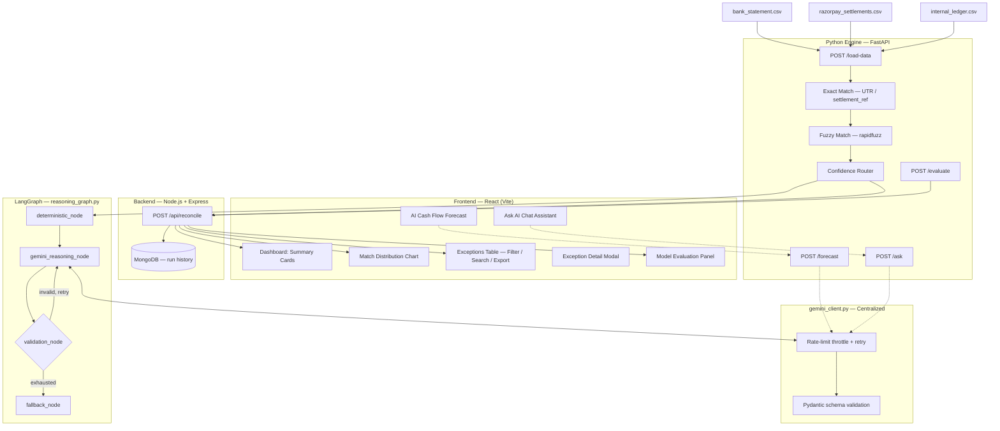

# AI Finance Controller — Multi-Source Reconciliation Agent

**Razorpay Build Thon — Track 4: AI Finance Controller**

An AI-powered reconciliation engine that automatically matches transactions across bank statements, payment gateway settlements, and internal accounting ledgers — replacing hours of manual Excel-based reconciliation with a system that matches, explains, evaluates, and forecasts in seconds.

---

## The Problem

Finance teams reconcile the same transaction across 3 disconnected sources every month:
- **Bank Statement** — what actually landed in the account
- **Settlement Report** — what the payment gateway says was settled
- **Internal Ledger** — what accounting recorded against an invoice

Naming conventions differ across all three. Dates shift by a few days. Amounts differ due to gateway fees. Today, this is resolved manually — a 500-transaction month can take 10–15 hours of an analyst's time, with no audit trail explaining *why* a mismatch happened.

Existing tools (including RazorpayX's settlement dashboard) **report** this data — they don't **reconcile** or **explain** it. The matching and reasoning is still entirely manual.

---

## What This Does

1. **Matches** records across all three sources — exact match first (UTR/reference), then fuzzy match (name similarity, amount tolerance, date tolerance) using `rapidfuzz`
2. **Classifies** every record into one of four confidence tiers instead of a binary matched/unmatched:
   - Fully Matched (exact)
   - Fuzzy Matched (≥70% confidence)
   - Needs Review (40–69% confidence)
   - Unmatched (<40% confidence)
3. **Explains** every exception in plain English using an LLM (Gemini) — not a generic template, a reason specific to that record's actual discrepancy
4. **Proves its own accuracy** — evaluated against a labeled ground-truth dataset, with a full confusion matrix and honestly-reported misclassifications
5. **Forecasts** expected cash inflow for the next 7 days based on historical settlement patterns
6. **Answers questions** about the reconciliation run in natural language via a chat interface

---

## Why This Is Different

Most reconciliation demos are a thin LLM wrapper: dump data into a prompt, get text back. This system is built the way a production finance tool would be:

- **Deterministic math stays deterministic.** Matching scores and confidence percentages are computed by `pandas`/`rapidfuzz`, never by the LLM. The LLM is only ever asked to *explain*, never to *calculate* — this eliminates numeric hallucination risk entirely.
- **The LLM only sees what it needs to.** Fully-matched records never reach the LLM at all — only ambiguous/unmatched records are sent for reasoning, which cuts API cost and latency significantly.
- **AI output is schema-validated, not trusted blindly.** Every LLM response is validated against a Pydantic schema. If the model returns malformed output, the system automatically retries before falling back to a safe, rule-based explanation — it never crashes and never shows garbage to the user.
- **The system measures itself.** Rather than just claiming "AI-powered," it runs an evaluation pass against ground-truth labels and reports precision per category, a confusion matrix, and specific misclassified examples — currently **98.33% overall accuracy**.

---

## Architecture

The reasoning layer is implemented as a **LangGraph state machine**, not a single LLM call:

```
deterministic_node → gemini_reasoning_node → validation_node
                                                  │
                              ┌───────────────────┼──────────────────┐
                        invalid, retry<2      invalid, retry≥2      valid
                              │                    │                  │
                        (loop back)          fallback_node           END
                                                    │
                                                   END
```

- **`deterministic_node`** — passes fully-matched records straight through. No LLM call.
- **`gemini_reasoning_node`** — batches ambiguous records (15/batch) and sends them to Gemini for reasoning.
- **`validation_node`** — validates the LLM's JSON response against a Pydantic schema (`ReasoningItem` / `ReasoningBatch`). Invalid output triggers a retry loop (max 2 attempts).
- **`fallback_node`** — if retries are exhausted, returns a clearly-labeled rule-based reason instead of failing the request.

Full system diagram:



---

## Tech Stack

| Layer | Technology |
|---|---|
| Frontend | React (Vite), Recharts |
| Backend | Node.js, Express, MongoDB |
| Matching Engine | Python, FastAPI, pandas, rapidfuzz |
| AI Reasoning | LangGraph, Pydantic, Google Gemini (`gemini-3.6-flash`) |
| Evaluation | Custom accuracy/confusion-matrix engine against labeled ground truth |

---

## Results

On a 168-record synthetic dataset (60 transaction groups across 3 sources, deliberately seeded with date shifts, fee deductions, and missing entries):

| Category | Accuracy |
|---|---|
| **Overall Model Accuracy** | **98.33%** |
| Fully Matched | 100% |
| Fuzzy Matched | 100% |
| Unmatched Detection | 91.67% |

| Match Distribution | % of records |
|---|---|
| Fully Matched | 59% |
| Fuzzy Matched | 16% |
| Needs Review | 13% |
| Unmatched | 13% |

**Impact estimate:** A manual reconciliation of this scale typically takes a finance analyst 2–3 hours. This system completes matching + AI reasoning + evaluation in under 30 seconds.

---

## Setup

### Prerequisites
- Node.js 18+
- Python 3.10+
- MongoDB (local or Atlas)
- A Gemini API key ([get one here](https://ai.google.dev/))

### Installation

```bash
# 1. Clone the repo
git clone <repo-url>
cd finance-controller-agent

# 2. Set up the Python engine
cd engine
python -m venv venv
venv\Scripts\activate      # Windows
pip install -r requirements.txt
# Add your Gemini key to engine/.env:
# GEMINI_API_KEY=your_key_here

# 3. Set up the Node backend
cd ../server
npm install
# Add to server/.env:
# MONGODB_URI=your_mongodb_connection_string
# PORT=5000

# 4. Set up the React frontend
cd ../client
npm install
# Add to client/.env:
# VITE_API_URL=http://localhost:5000
```

### Running

Open three terminals:

```bash
# Terminal 1 — Python engine
cd engine
python main.py
# Runs on http://localhost:8000

# Terminal 2 — Node backend
cd server
npm start
# Runs on http://localhost:5000

# Terminal 3 — React frontend
cd client
npm run dev
# Runs on http://localhost:5173
```

Open `http://localhost:5173`, click **Run Reconciliation**, and the full pipeline — matching, AI reasoning, evaluation, and forecast — executes end to end.

### Generating fresh test data

```bash
cd engine
python generate_data.py
```

This regenerates `bank_statement.csv`, `razorpay_settlements.csv`, `internal_ledger.csv`, and `ground_truth.csv` with a new randomized (but reproducible) set of transactions and known discrepancy patterns.

---

## What We'd Build Next

- Replace synthetic data with a real bank-statement parser (PDF/OCR ingestion)
- Human-in-the-loop correction — let a user accept/reject "Needs Review" matches and use that feedback to recalibrate confidence thresholds over time
- GST/TDS tax-line matching as a fourth reconciliation dimension
- Multi-tenant support for reconciling across multiple business entities/outlets in one run

---

## Running Tests & Evaluation

To run tests:
```bash
cd engine
pytest test_reconcile.py test_investigation.py test_forecast.py test_review_workflow.py test_audit_workflow.py
```

To run a standalone evaluation:
```bash
cd engine
python -c "import requests, json; print(requests.post('http://localhost:8000/evaluate', json={'summary':{}}).json())"
```
*(Note: Full evaluation happens automatically on the frontend Dashboard via the backend pipeline.)*

---

## Deployment Instructions

### Frontend (React/Vite)
1. Build the production app: `cd client && npm run build`
2. Serve the `dist` folder using Nginx, Vercel, or AWS S3.
3. Ensure the environment variable `VITE_API_URL` points to your production backend URL.

### Backend (Node.js)
1. Set `PORT`, `MONGODB_URI`, and `PYTHON_ENGINE_URL` in your production environment.
2. Start the server: `cd server && npm start`
3. Host on Render, Heroku, AWS EC2, or equivalent.

### Engine (Python/FastAPI)
1. Set `GEMINI_API_KEY` in the environment.
2. Start the production server: `cd engine && uvicorn main:app --host 0.0.0.0 --port 8000`
3. Host on a scalable platform like GCP Cloud Run or AWS ECS.

---

## Methodologies

### Reconciliation Methodology
1. **Validation & Normalization**: Strips spaces, unifies date formats (YYYY-MM-DD), handles NaN/Null.
2. **Exact Matching**: Matches UTR / Settlement References directly across sources.
3. **Fuzzy Matching**: Uses `rapidfuzz` for text similarity (e.g. name variations) and sets tolerances for dates (±3 days) and amounts (±5%).
4. **Categorization**: Groups are marked as `FULLY_MATCHED`, `FUZZY_MATCHED`, `NEEDS_REVIEW`, or `UNMATCHED`.

### AI Architecture & Investigation
1. **Evidence Collection**: Gather normalized row data for mismatched records.
2. **Deterministic Fallback**: If LLM times out or hallucinates (caught by Pydantic schema), a deterministic reason is used.
3. **Investigation Graph**: LangGraph node batches requests to Gemini (gemini-3.6-flash), asking it to classify the mismatch (e.g. "Missing from bank", "Amount mismatch due to fee").

### Forecast Methodology
1. **Baseline**: Takes current cash position from ledger/bank total.
2. **Pending Transactions**: Reconciled groups with un-settled elements (e.g. fuzzy/needs review) are processed to identify pending inflows and outflows.
3. **Thresholding**: Checks if projected cash balance for the next 7 days drops below the `minimum_safe_cash` threshold (default ₹50,000).

---

## Known Limitations

- **Scalability of AI**: Large datasets (>10,000 exceptions) may hit LLM rate limits unless batched with higher quota.
- **Mocked Auth**: The current app lacks real authentication/authorization for human reviewers.
- **File Upload Limitations**: Files are stored temporarily on disk; a production system should stream them to cloud storage (S3/GCS).

---

## Team

Built solo for Razorpay Build Thon, Track 4 — AI Finance Controller.